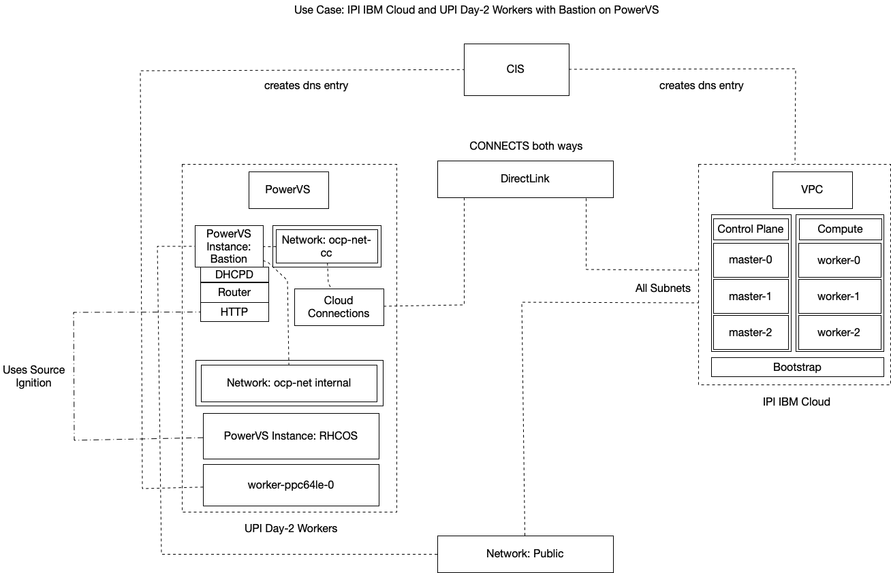

# Development 
The code is built with Terraform and may in the future include Ansible and Shell scripts.

## Architecture

This architecture augments an existing IBM VPC hosted Red Hat OpenShift Container Platform cluster with IBM PowerVS hosted workers. The approach uses the ignition file from the existing cluster in order to boot Red Hat CoreOS with the cluster's MachineConfigPool `worker`.

This architecture only adds compute plane workers.

## Steps

1. 

## Dependencies: Providers

The automation code uses the following providers:

1. [ibm-cloud/ibm](https://registry.terraform.io/providers/IBM-Cloud/ibm/latest/docs) to deploy a work on a Power Systems Virtual Server Instance.
2. [hashicorp/random](https://registry.terraform.io/providers/hashicorp/random/latest/docs) sets a random id for the 
3. [hashicorp/null](https://registry.terraform.io/providers/hashicorp/null/latest/docs) we may use this in the future to sign the CSR on the bastion
4. [community-terraform-providers/ignition](https://registry.terraform.io/providers/community-terraform-providers/ignition/latest/docs) [git](https://github.com/community-terraform-providers/terraform-provider-ignition)

### To Enable
- [ ] 1. Add/Provision a DHCP Server for the Service similar to
[link](https://github.com/openshift/installer/blob/46c35943df50a2bf83de8e0e22a8a9bae0a55bdf/data/data/powervs/cluster/master/vm/main.tf)
- [ ] 2. Log into the Bastion node and accept the CSR
- [ ] 3. user Data is limited to 65K (we may need to keep this light...)
- [ ] 4. Add Cloud Connection
